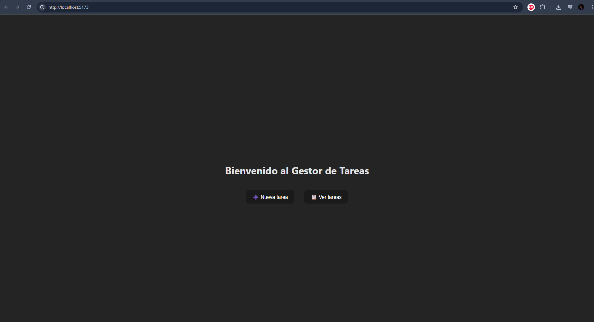
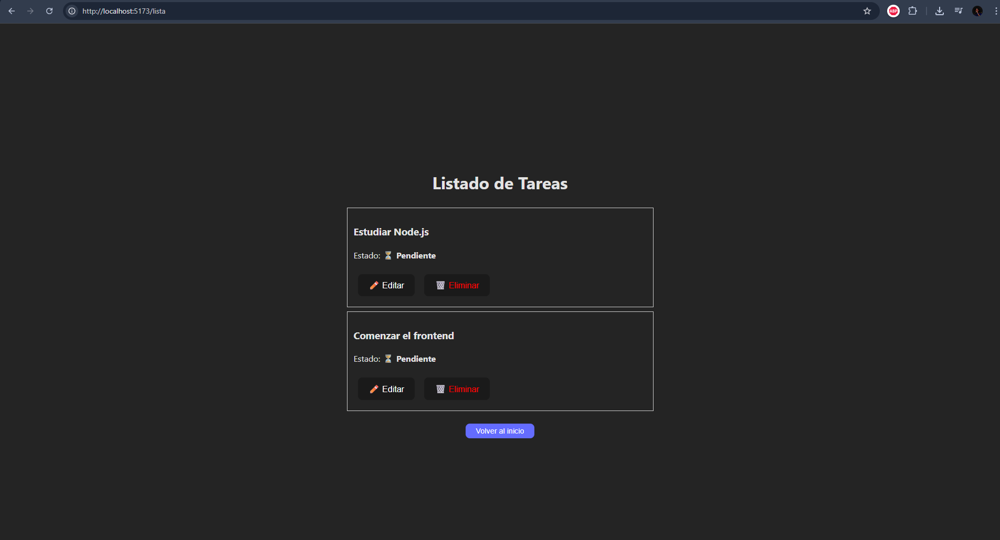
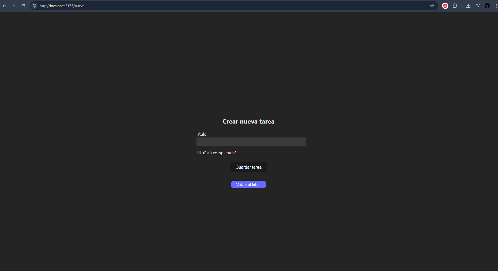
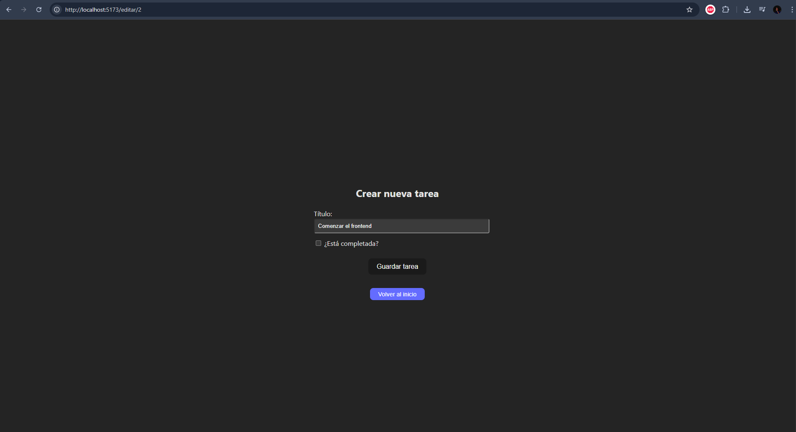
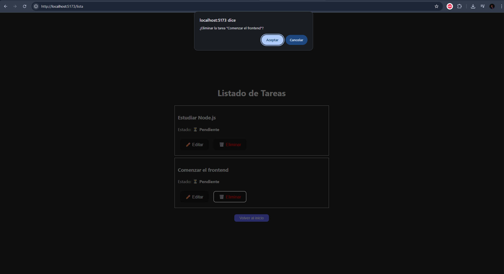

# Gestor de Tareas – Challenge Técnico ForIT

Aplicación desarrollada como parte del challenge técnico de la academia **ForIT**. El sistema permite crear, editar, eliminar y visualizar tareas de manera simple y eficiente, con una interfaz clara y adaptable a distintos dispositivos.

## Funcionalidades principales

- Listado completo de tareas
- Edición de tareas
- Eliminación con confirmación
- Creación de nuevas tareas
- Navegación fluida y botón de volver
- Diseño centrado, claro y en modo oscuro suave

## Tecnologías utilizadas

### Frontend
- React (con Vite)
- React Router DOM para navegación entre vistas
- CSS nativo (sin frameworks como Tailwind)
- Componentes reutilizables (como `FormularioTarea` y `BotonVolver`)

### Backend
- Node.js con Express.js
- API REST simulada con una base de datos en memoria (sin persistencia)

## Estructura del proyecto

ForIT-Challenge/
├── backend/
│ └── index.js
├── frontend/
│ └── src/
│ ├── components/
│ └── pages/
├── capturas/
│ ├── crear-tarea.png
│ ├── editar-tarea.png
│ ├── eliminar-tarea.png
│ ├── inicio.png
│ └── lista-tareas.png
└── README.md

### Cómo ejecutar el proyecto
## Backend
- cd backend
- npm install
- npm start
- Accede a: http://localhost:3000

## Frontend
- cd frontend
- npm install
- npm run dev
- Accede a: http://localhost:5173

### Capturas del sistema

## Inicio

## Lista de tareas

## Crear nueva tarea

## Editar tarea existente

## Confirmación al eliminar

### Observaciones y consideraciones personales
- El proyecto fue construido desde cero, sin librerías de UI ni generadores automáticos.
- Todo el sistema funciona de manera local, ideal para pruebas o ampliaciones futuras.
- El backend no incluye persistencia en base de datos, por lo tanto, los datos se reinician al reiniciar el servidor.

Este proyecto fue desarrollado como parte del challenge técnico de la academia ForIT. Si bien pude contar con el apoyo de herramientas de inteligencia artificial para aprender y avanzar más rápido, todo el trabajo fue realizado con la intención de entender realmente el funcionamiento de cada parte del sistema.

Actualmente me encuentro cursando el último año de la Tecnicatura en Desarrollo de Software, combinando mis estudios con trabajo y otras responsabilidades. Esto hace que muchas veces el tiempo sea limitado, pero aun así decidí encarar este desafío como una gran oportunidad para medir mis conocimientos reales, reforzar conceptos y mejorar mi manera de encarar proyectos completos.

No puedo garantizar que todo esté perfecto, pero sí puedo afirmar que cada línea de este proyecto fue una instancia de aprendizaje. Agradezco sinceramente la oportunidad brindada por ForIT, y más allá del resultado de esta evaluación, me quedo con la satisfacción de haber completado un sistema funcional, claro y presentable, que demuestra mi progreso y compromiso.

Gracias por tomarse el tiempo de revisar este proyecto.

### Autor
Ricardo Barceló
- Esperanza, Santa Fe – Argentina
- rickybarcelo11@gmail.com
- GitHub: rickybarcelo11

